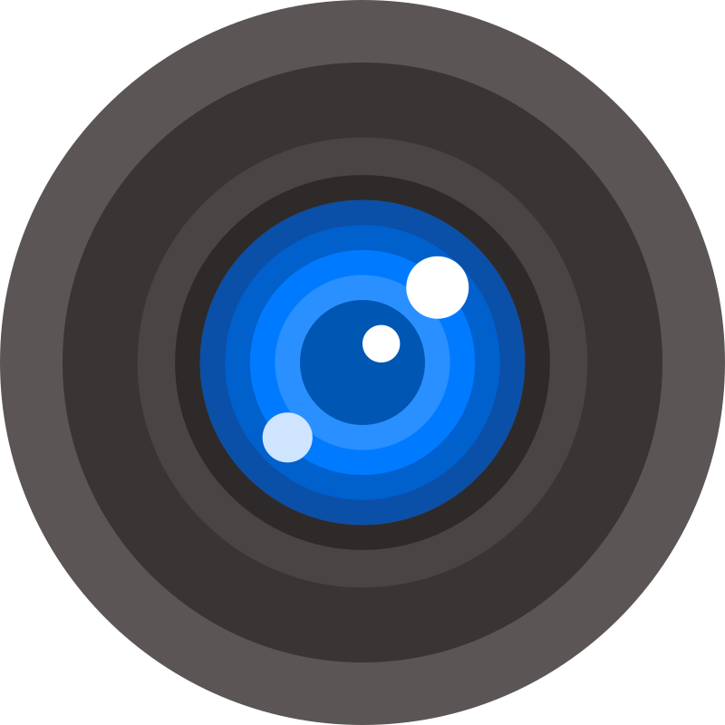
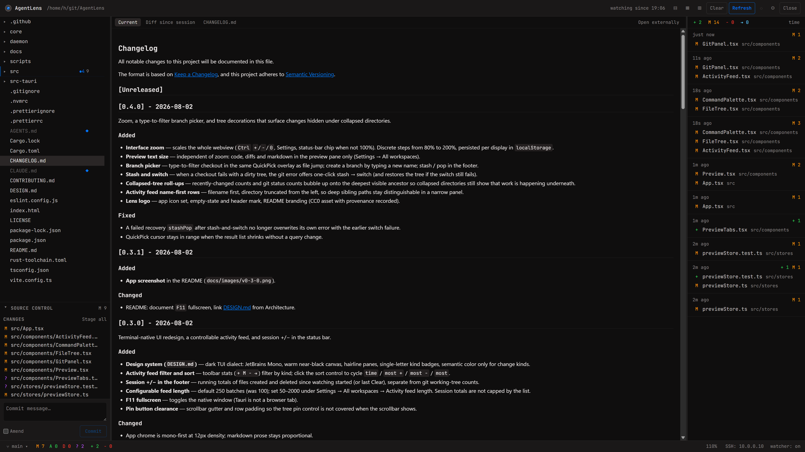

<p align="center">
  
</p>

<h1 align="center">AgentLens</h1>

[](https://github.com/harrison-wallace/AgentLens/actions/workflows/ci.yml)
[](https://github.com/harrison-wallace/AgentLens/actions/workflows/release.yml)
[](CHANGELOG.md)
[](LICENSE)

[](https://tauri.app)
[](https://www.rust-lang.org)
[](https://react.dev)
[](https://www.typescriptlang.org)
[](#install)

A lightweight, open-source observer for agentic coding. Not an IDE — a
read-only window into what your terminal coding agent (Claude Code, Grok, …)
is doing to a directory: live file tree, change feed, git status, read-only
previews. Runs on Windows and Ubuntu.

**Status:** v0.7.0 — the MVP feature set is complete, including remote
workspaces over WSL and SSH with no manual setup on the remote machine. Still
pre-alpha: acceptance testing on Windows and Ubuntu is outstanding.



## What works today

- **Live file tree** — virtualized, lazy, gitignore-aware, with git status
  badges and a fading highlight on whatever just changed.
- **Activity feed** — filesystem changes grouped per debounced burst; filter
  and sort from the toolbar, click a row to reveal it in the tree. An
  `npm install` produces no feed spam. Session +/− totals live in the status
  bar.
- **Read-only preview** — syntax-highlighted code, images, rendered markdown,
  with a size guard and an "open externally" escape hatch.
- **Three diff sources, one view** — what changed in a file since you started
  watching, against `HEAD`, or staged against `HEAD`. Hunks collapse, large
  diffs are capped, and binary or untracked files say so rather than showing
  nonsense.
- **Agent context files always visible** — `AGENTS.md`, `CLAUDE.md` and
  friends are surfaced and marked even when `.gitignore` hides them, because
  they are what the agent is being told to do.
- **Pinned paths** — pin any file or directory from its tree row to keep it
  visible regardless of `.gitignore` and grouped at the top of the tree.
- **Git actions** — stage, unstage, commit (with amend), switch and create
  branches, stash and pop, without leaving the app. Mutations go through the
  `git` CLI, so your hooks run and your config is honoured exactly as in the
  terminal.
- **Remote workspaces, with no setup** — observe a WSL distro from the Windows
  app, or a Linux box over SSH, with the same tree, feed, git decorations and
  actions. A small headless daemon runs where the files are and streams over
  stdio: no ports, no tunnels, and SSH auth is your own `ssh` binary's. If the
  machine has never run AgentLens, the app installs the daemon there itself.
  See [docs/REMOTE.md](docs/REMOTE.md).
- **Preview tabs** — several files open at once, VS Code-style: single-click
  opens a preview tab (replaced by the next click), double-click or Enter
  keeps it; feed / git / `Ctrl+P` jumps open permanent tabs. `Ctrl+Tab` /
  `Ctrl+Shift+Tab` cycle, `Ctrl+W` closes, middle-click closes a tab. Open set
  is remembered per workspace; tree rows show a dot when open.
- **Command palette** — `Ctrl+Shift+P` runs any command from one registry;
  `F1` (or `Ctrl+/`) lists every shortcut, generated from that same registry
  so it can never drift from what the keys actually do.
- **Light theme** — dark by default, or follow the OS, switched from Settings.
- **`Ctrl+P` file jump**, **`F11` fullscreen**, **`Ctrl` `+`/`−`/`0` zoom**
  (with an independent preview text size), arrow-key tree navigation,
  resizable and collapsible panels, and per-workspace extra ignore globs.
- **Quiet by design** — errors arrive as dismissible toasts with a copyable
  detail drawer, never a modal dialog; the window remembers its size and
  position; and a notify-only release check tells you a new version exists
  without ever downloading anything (switch it off in Settings).

## Why not VS Code / a file explorer

AgentLens is not an editor. It doesn't open files for editing and it doesn't
run your agent — it passively watches a directory and correlates filesystem
changes with what your terminal agent is doing, in a window you can leave
open next to your terminal. If you want to edit something, open it in your
real editor; AgentLens stays out of the way.

Three rules follow from that, and they explain most of the design:

- **Read-only by default.** Previews never edit, and nothing is written
  behind your back. Git operations are the only thing that mutates your
  repository, and only when you ask for one.
- **Ignore aggressively, but not blindly.** `.gitignore` marks two different
  things — build noise, and files that are yours rather than the team's. The
  first is hidden; the second (agent context files, anything you pin) stays
  visible.
- **Debounce everything.** Agents write in bursts. The feed and the tree
  coalesce them instead of flickering once per file.

## Configuration

Settings are split by what they affect, not where they're stored.

| Scope              | Setting                       | Purpose                                                                          |
| ------------------ | ----------------------------- | -------------------------------------------------------------------------------- |
| **This workspace** | Show git-ignored files        | Reveal everything `.gitignore` hides. An escape hatch, not an everyday setting.  |
| **This workspace** | Pinned paths                  | Files and directories kept visible and grouped at the top of the tree.           |
| **This workspace** | Extra ignore globs            | Gitignore syntax; hidden from the tree, the file jump, and the activity feed.    |
| **All workspaces** | Show agent context            | Surface `AGENTS.md`, `CLAUDE.md` and friends even when git ignores them.         |
| **All workspaces** | Interface zoom                | Scales the whole window. Also `Ctrl` `+`/`−`/`0`; shown in the status bar.       |
| **All workspaces** | Preview text size             | Code, diffs and markdown in the preview pane only. The zoom multiplies it.       |
| **All workspaces** | Agent session folders         | Where to look for coding-agent sessions. Detected automatically; add your own.   |
| **All workspaces** | Activity feed length          | Max batches kept in the feed (default 250). Session +/− totals still accumulate. |
| **Remote**         | Set up machines automatically | Install the observer on a WSL distro or SSH host that hasn't got one.            |
| **Remote**         | Daemon command                | Run exactly this on the remote instead. The escape hatch; normally unset.        |

Panel widths and collapse state are view state, not configuration — they're
remembered automatically and stay out of the settings dialog.

## Roadmap

| Phase | Description                                                                        | Status           |
| ----- | ---------------------------------------------------------------------------------- | ---------------- |
| 0     | Scaffolding — app skeleton, CI on Windows + Ubuntu, release pipeline               | Done             |
| 1     | Local observer MVP — file tree, gitignore-aware watcher, activity feed, git status | Feature-complete |
| 2     | Agent integration — agent transcript tailing, file-event ↔ tool-call correlation   | In progress      |
| 3     | Git actions + polish — stage/commit/branch/stash, diff view, command palette       | Feature-complete |
| 4     | Remote — headless daemon for WSL-from-Windows and SSH                              | Feature-complete |

Everything up to and including phase 3 shipped as `0.0.x`. `v0.1.0` marked
phase 4 landing and the MVP being complete.

## Install

Download the installer for your platform from
[Releases](https://github.com/harrison-wallace/AgentLens/releases). Pre-1.0
Windows installers are unsigned, so SmartScreen will warn before you can run
them — this is expected until code signing lands.

To observe a WSL distro or an SSH host, just open a workspace there — the app
puts the observer on that machine itself. [docs/REMOTE.md](docs/REMOTE.md)
covers how, and how to place it by hand if you would rather.

## Build from source

Prerequisites:

- Node (version pinned in [`.nvmrc`](.nvmrc))
- Rust stable (pinned via [`rust-toolchain.toml`](rust-toolchain.toml))
- On Ubuntu, the Tauri v2 system packages: `libwebkit2gtk-4.1-dev
libayatana-appindicator3-dev librsvg2-dev patchelf build-essential curl wget
file libxdo-dev libssl-dev`

```sh
npm install
npm run tauri dev    # run locally
npm run tauri build  # produce an installer
```

## Architecture

A Tauri v2 desktop app: a Rust backend doing the filesystem and git work, a
React front end rendering it.

| Layer        | What it does                                                                   |
| ------------ | ------------------------------------------------------------------------------ |
| `core/`      | Filesystem watcher, git status and actions, previews, snapshots, agent tailing |
| `daemon/`    | `core` with a stdio front door — the headless observer for remote machines     |
| `src-tauri/` | The desktop app — commands, windows, settings persistence, transport choice    |
| `src/`       | React UI — tree, activity feed, preview pane, source control, settings         |

`core/` deliberately has no dependency on Tauri: everything crossing the
boundary is a serializable message defined in `core/src/protocol.rs` and
mirrored in `src/lib/protocol.ts`. Watching files over a network filesystem
doesn't work, so `core` also runs as a headless daemon where the files
actually are (a WSL distro, an SSH host) and streams to the UI. The app talks
to both through one `Backend` trait and cannot tell them apart —
see [docs/PROTOCOL.md](docs/PROTOCOL.md) for the wire format and the
versioning policy.

UI tokens and chrome conventions live in [DESIGN.md](DESIGN.md) (dark mono
TUI dialect).

## Contributing

See [CONTRIBUTING.md](CONTRIBUTING.md) for dev setup, required checks, and
the PR flow.

CI runs `cargo fmt --check`, `cargo clippy -D warnings`, `npm run lint`,
`npm run typecheck`, and the full test suite on both Windows and Ubuntu
before it will build.

## License

[MIT](LICENSE)

The lens logo is [_Lens_](https://www.svgrepo.com/svg/5427/lens) from SVG Repo's
Camera And Accessories 3 collection, released under
[CC0](https://creativecommons.org/publicdomain/zero/1.0/). No attribution is
required; it is recorded here so the asset's provenance is answerable.
